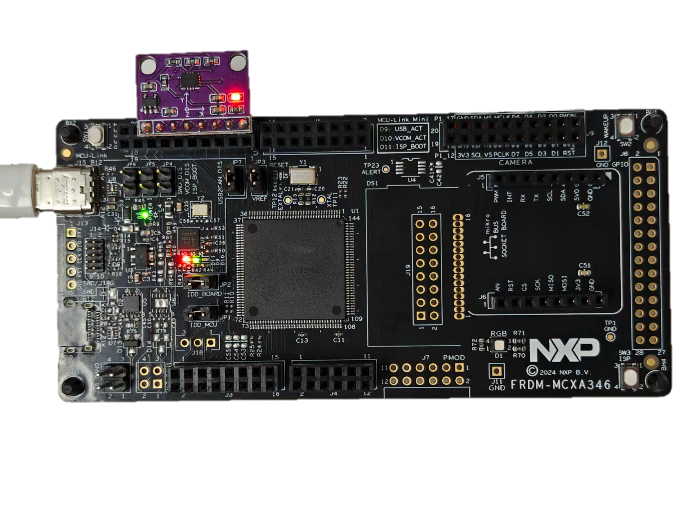
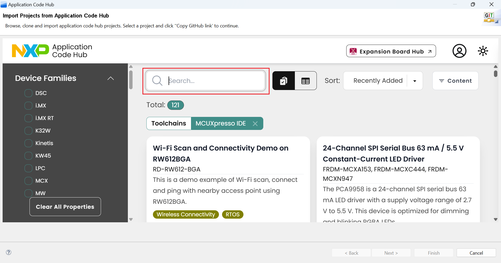

# NXP Application Code Hub

## How to use smartdma to implement spi interface on mcxa346
This software accompanies application note [AN14822], which describes how to use SmartDMA to implement SPI interface on mcxa346.

This application note describes the use of SmartDMA to implement the SPI (Serial Peripheral Interface) on MCXA series MCUs. It includes the introduction of SPI interface, SmartDMA implementation details, and a practical demonstration using the ICM42688 6-axis IMU sensor. In MCXA MCU, there is a co-processor called SmartDMA, which can be used to implement flexible SPI interface with precise timing control and low CPU overhead.

**Performance**:

·    The SmartDMA can use the system clock of the MCU as its clock source

·    Support for configurable SPI clock frequencies up to 25 MHz under 150MHz system clock

·    Hardware-level GPIO control for sub-microsecond response times

·    Support for various SPI modes (CPOL/CPHA combinations)

·    Efficient data transfer with minimal CPU intervention

#### [Boards]
#### Categories: Motor Control, Sensor
#### Peripherals: GPIO, SmartDMA, SPI
#### Toolchains: MCUXpresso IDE

## Table of Contents
1. [Software](#step1)
2. [Hardware](#step2)
3. [Setup](#step3)
4. [Results](#step4)
5. [FAQs](#step5) 
6. [Support](#step6)
7. [Release Notes](#step7)

## 1. Software
- [MCUXpresso IDE V25.6](https://www.nxp.com/design/design-center/software/development-software/mcuxpresso-software-and-tools-/mcuxpresso-integrated-development-environment-ide:MCUXpresso-IDE) or later
- [SDK_25_06_00_FRDM-MCXA346](https://mcuxpresso.nxp.com/zh)
- MCUXpresso for Visual Studio Code: This example supports MCUXpresso for Visual Studio Code, for more information about how to use Visual Studio Code please refer [here](https://www.nxp.com/design/design-center/training/TIP-GETTING-STARTED-WITH-MCUXPRESSO-FOR-VS-CODE).

## 2. Hardware
- FRDM-MCXA346

- ICM42688 module

- USB Type-C cable

- Personal Computer

  [note]:This project requires an ICM42688 sensor module. If this specific model is unavailable, you may choose a functionally similar ICM42688 six-axis sensor module as an alternative.

## 3. Setup
### 3.1 Hardware Setup

1. Connect both development boards according to the pin mapping table.

   | **FRDM-MCXA346 Header** | **Header   Signals** | **SmartDMA**   | **Sensor   Module** | **Function**         |
   | ----------------------- | -------------------- | -------------- | ------------------- | -------------------- |
   | J2-6                    | P3_11                | SmartDMA_PIO11 | CS                  | Chip Select          |
   | J2-8                    | P3_8                 | SmartDMA_PIO8  | MOSI                | Master Out  Slave In |
   | J2-10                   | P3_9                 | SmartDMA_PIO9  | MISO                | Master In  Slave Out |
   | J2-12                   | P3_10                | SmartDMA_PIO10 | CLK                 | Clock                |
   | J2-14                   | GND                  | -              | GND                 | Ground               |
   | J2-16                   | VCC                  | -              | VCC                 | Power  Supply        |

2. Connect both boards to computer via USB cables. The hardware as below:

    

### 3.2 Import Project

1. Open MCUXpresso IDE, in the Quick Start Panel, choose **Import from Application Code Hub**. 

   

2. Enter the demo name in the search bar.  

   

3. Click **Copy GitHub link**, MCUXpresso IDE will automatically retrieve project attributes, then click **Next>**.  

   

4. Select **main** branch and then click **Next>**, Select the MCUXpresso project, click **Finish** button to complete import.  

   

### 3.3 Demo hands-on 

1. Compile the project(**an-mcxa346-spi-interface-implemented-by-smartdma**) and download it to the FRDM-MCXA346 board.
2. Open serial port assistant and set baud rate to 230400.

## 4. Results
1. Click reset to start the program, system will first calibrate and initialize the sensor, then print six-axis sensor values every second.

2. Rotate the development board to observe changes in acceleration and angular velocity values.

   Below are some of the serial port output results.

    ***=== SmartDMA SPI ICM42688 Example ===***

   ***Initializing ICM42688...***

   ***ICM42688 initialized successfully!***

   ***Please keep the sensor stationary and horizontal for calibration...***

   ***Auto-calibrating accelerometer... Keep sensor stationary!***

   ***Raw Z average: 2028.7 LSB (from 100 samples)***

   ***Calculated scale factor: 2028.7 LSB/g***

   ***=== Scale Factor Verification ===***

   ***Gyro range: ±2000 dps, Scale factor: 16.4 LSB/dps***

   ***Accel range: ±4g, Scale factor: 2048.0 LSB/g***

   ***Expected: Gyro ~0 dps when stationary, Accel Z ~±1g when horizontal***

   ***================================***

   ***Starting sensor data reading (1Hz)...***

   ***[0001] Accel(g): X= 0.012 Y=-0.041 Z= 1.000 | Gyro(dps): X= -0.18 Y= -0.12 Z=   0***

   ***[0002] Accel(g): X= 0.011 Y=-0.040 Z= 1.000 | Gyro(dps): X= -0.24 Y= -0.12 Z=   0***

   ***[0003] Accel(g): X= 0.013 Y=-0.041 Z= 1.000 | Gyro(dps): X= -0.24 Y= -0.06 Z=   0***

## 5. FAQs
*Include FAQs here if appropriate. If there are none, then remove this section.*

## 6. Support
*Provide URLs for help here.*

#### Project Metadata

<!----- Boards ----->

<!----- Categories ----->

<!----- Peripherals ----->

<!----- Toolchains ----->

Questions regarding the content/correctness of this example can be entered as Issues within this GitHub repository.

>**Warning**: For more general technical questions regarding NXP Microcontrollers and the difference in expected functionality, enter your questions on the [NXP Community Forum](https://community.nxp.com/)

## 7. Release Notes
| Version | Description / Update                    |                        Date |
| :-----: | --------------------------------------- | --------------------------: |
|   1.0   | Initial release on Application Code Hub | August 22nd 2025 |
